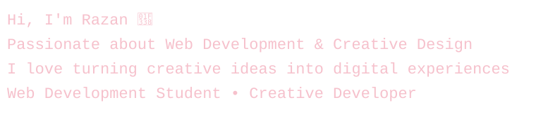

---
### 👩🏻‍💻 About Me
- 💻 Programming & Web Development Student at Technical College
- 🌐 Interested in Web Design, Creative Digital Solutions and Web Development & Software Development
- 🌱 Currently Learning about Advanced Internet Technologies and Smart Devices Programming
- 🎯 Goal: Passionate about building practical, smart & meaningful technology solutions
---

### 🛠️ Tech Stack & Tools

  
  
   
  
  
  

